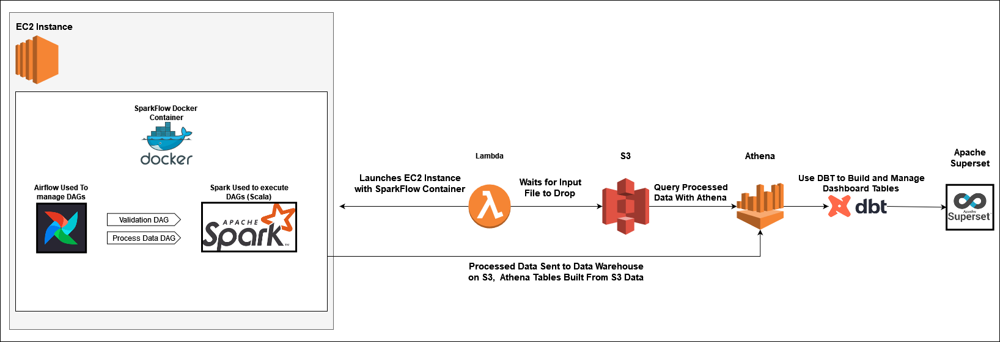

# SparkFlow

### Overview
This project was used to learn more about Data Engineering.  Specifically I wanted to get some experience using Docker, Spark, Airflow, and Terraform.  The infrastructure for this project can be used for any kind of data, however, I will be validating and processing my household finances.  Again the main motivation for this repository is to learn and get experience with new tools, that being said, if I'm going to analyze data, I would like to analyze something that will be beneficial to me.  Given that the use case of the data is very personal, I won't be publishing any real data/insights within this project.  Any examples that I use to showcase the functionality of the system I built will be built from randomly generated data based off of the structure of my database.

One important note before moving on, since this is a personal project that utilizes AWS, I will be minimizing up time and costs as much as possible.  Obviously I do not want to spend a ton of money on a personal experiment, and my tech stack will be running so infrequently that it wouldn't make sense to keep resources running.  This means that approaches that I take may not be the most conventional use of a given tool.  For example, I utilize airflow in this project.  In a professional productionized environment, you would probably want to keep the airflow instance up 100% of the time.  For me, I will have a handful of DAGs that will run infrequently, it does not make sense to pay for the EC2 to run indefinitely.  I also wanted to really focus on [IaC](https://en.wikipedia.org/wiki/Infrastructure_as_code) in this project, building up and tearing down services as needed not only made sense for costs, but met this goal.

### How it Works

There are multiple components to this infrastructure, they will all revolve around a data lake that will be stored on S3. I will be processing raw data files that get dropped in S3 and query them using the serverless database Athena.  This worked well for my use case as my database is small.  Athena is lightweight and requires almost no setup, vs something more robust like redshift that would require more work up front to get up and running.  Here is how the process works:

1. A lambda function monitors a specific location in my S3 bucket.  When a raw file is dropped in the monitored path, it spins up an EC2.  It feeds in some intial set up instructions to the EC2 on launch, namely installing dependencies like git and docker, pulling down my repository, and launching the sparkflow container using my [docker-compose](/sparkflow/docker-compose.yml).
2. Once the EC2 is launched the lambda dies, and a coordinator.py script is launched.  This coordinator waits for both airflow and spark to finish launching, it then sets the connection between airflow and spark and kicks off the appropriate DAGs.  This is one area where you may think is unconventional, and it is.  If this was a normal environment, airflow would be handling all of the scheduling/triggers, however, we are building and tearing down this cluster on an as needed basis.  That being said, airflow is still useful here, it gives me an entire infrastructure to store and kick off my DAGs easily.  In the past, I would have had to have written a lot of code to get the same functionality.
3. The Airflow DAGs do not contain the bulk of the ETL logic.  I wanted to learn more spark within this project, and therefore all of my DAGs are technically written in scala.  These scala files will get compiled into their respective JAR files during the CICD step, airflow will pass these JAR files to the spark cluster where they will be executed.  Airflow will wait for the cluster to finish running the JAR file and return back the pass/failure of the pipeline.  The Scala Spark process will write the processed files directly to S3, where Athena can then query them.
4. The final piece of this project is putting together some kind of dashboard to visualize and analyze the data.  I will most likely be using apache superset as it is a free and open sourced dashboarding tool.  This would require another EC2 to host the superset environment.  So far, this is the piece that I have thought about the least and may change as I work through the rest of the infrastructure.
