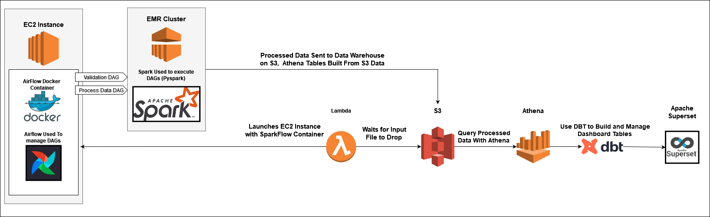

# SparkFlow

- [Overview](#overview)
- [How it Works](#how-it-works)
- [Development](#development)
- [Deployment](#deployment)

# Overview
This project was used to expand on my Data Engineering skills.  Specifically I wanted to get some experience using Docker, Spark, Airflow, and Terraform.  The infrastructure for this project can be used for any kind of data, however, I will be validating and processing my household finances.  Again the main motivation for this repository is to learn and get experience with new tools, that being said, if I'm going to analyze data, I would like to analyze something that will be beneficial to me.  Given that the use case of the data is very personal, I won't be publishing any real data/insights within this project.  Any examples that I use to showcase the functionality of the system I built will be built from randomly generated data based off of the structure of my database.

One important note before moving on, since this is a personal project that utilizes AWS, I will be minimizing up time and costs as much as possible.  Obviously I do not want to spend a ton of money on a personal experiment, and my tech stack will be running so infrequently that it wouldn't make sense to keep resources running.  This means that approaches that I take may not be the most conventional use of a given tool.  For example, I utilize airflow in this project.  In a professional productionized environment, you would probably want to keep the airflow instance up 100% of the time.  For me, I will have a handful of DAGs that will run infrequently, it does not make sense to run this resource indefinitely.  Unfortunately, this means I cannot use the very convenient Airflow managed services provided by most cloud providers ([MWAA](https://aws.amazon.com/managed-workflows-for-apache-airflow/) or [Cloud Composer](https://cloud.google.com/composer?hl=en) are possible examples).  I instead had to get into the nitty gritty of hosting my own airflow application within an EC2 which allowed me to quickly spin up and tear down my application on an as needed basis.

# How it Works

There are multiple components to this infrastructure, they will all revolve around a data lake that will be stored on S3. I will be processing raw data files that get dropped in S3 and query them using the serverless database Athena.  This worked well for my use case as my database is small.  Athena is lightweight and requires almost no setup, vs something more robust like redshift that would require more work up front to get up and running.  Here is how the process works:

1. My [lambda function](/infra/lambda/) is used to quickly spin up my airflow application on an EC2 when triggered.  It feeds in some initial set up instructions to the EC2 on launch which installs dependencies and pulls my airflow docker and DAGs from a zip file on S3 (which is built my deployment step [deployment](#deployment)).  It then launches the sparkflow container using my [docker-compose](/sparkflow/docker-compose.yml).
2. Once the EC2 is launched and the SparkFlow container is running, the first DAG triggered will launch a Spark EMR Cluster.  The subsequent DAGs will trigger if there is a corresponding input file in their monitored S3 locations.  These DAGs send pyspark jobs to the EMR cluster which validates and process these input files.
3. The final piece of this project is putting together some kind of dashboard to visualize and analyze the data.  I will use DBT to build and manage all of my dashboarding tables.  DBT will build a new db based off the "production" database.  It will be a separate git repo which manages all the SQL code required to deliver the dashboards.  I will most likely be using apache superset as it is a free and open sourced dashboarding tool.

# Development
The Launch.json has configurations that allow you to quickly run [launch_develop_env.py](/infra/cloud_develop/launch_develop_env.py).  This py file will launch and initialize an EC2 with a "production-like" environment.  It triggers the [lambda](/infra/lambda/SparkFlowEC2Launcher/lambda_function.py) which spins up the ec2 and sets up the repository.  Once the EC2 is running, the code will create the SSH connection from your local computer to the newly spun up EC2.  This allows us to develop in the cloud within an environment that is as close to production as possible.  This means we can limit the amount of requirements/configurations locally and we can get to work developing within this repo a lot faster.  There are a few prerequisites:
1. Download [Remote-SSH](https://marketplace.visualstudio.com/items?itemName=ms-vscode-remote.remote-ssh) from VS Code
2. Set up your aws credentials locally (see instructions [here](https://docs.aws.amazon.com/sdk-for-java/v1/developer-guide/setup-credentials.html))
3. The pem file must be in the top level of your local environment.  For obvious reasons the pem file is not stored in this repository.  You can get it from AWS.  If you need to convert a ppk file to pem, use PUTTYgen (PUTTYgen comes with [Putty](https://www.putty.org/))

Once [launch_develop_env.py](/infra/cloud_develop/launch_develop_env.py) runs you will see the IP of the EC2 within the Remote Explorer on VSCode.  At this point you can connect and start developing/testing new features within this repository.

# Deployment
This repository utilizes Github Actions along with Terraform to deploy our code and establish our infrastructure.  This is how the deployment works:
1. Github actions zips our core code for [sparkflow](/sparkflow/).  This includes our DAGs and docker images for airflow.
2. Github actions zips our code for our [sparkflow lambda](/infra/lambda/SparkFlowEC2Launcher/).  This is the lambda responsible for launching our airflow application as needed.
3. Terraform builds and maintains our [sparkflow lambda](/infra/lambda/SparkFlowEC2Launcher/).

### Github Actions and AWS
In order for Github Actions and Terraform to connect and interact with AWS we utilize a [OIDC connection](https://docs.github.com/en/actions/security-for-github-actions/security-hardening-your-deployments/about-security-hardening-with-openid-connect) instead of storing secrets on github. Specifically, we leverage [aws-actions/configure-aws-credentials](https://github.com/aws-actions/configure-aws-credentials).
